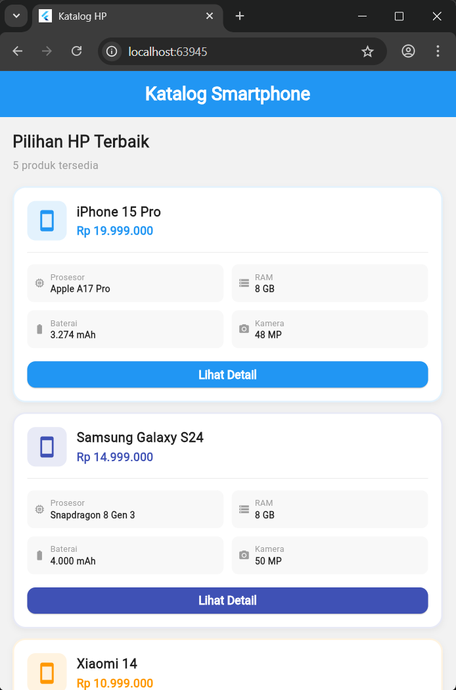

# Tugas Slicing - Katalog Smartphone

Implementasi UI Slicing sederhana menggunakan Flutter.
Menampilkan daftar smartphone beserta spesifikasi dan harganya.

## 📸 Screenshot



## ✨ Fitur

- Daftar HP dengan kartu (card) yang rapi
- Menampilkan spesifikasi lengkap (prosesor, RAM, baterai, kamera, layar)
- Harga dalam format Rupiah
- Warna tema berbeda per brand

## 🚀 Cara Menjalankan

```bash
git clone https://github.com/USERNAME/tugas_slicing.git
cd tugas_slicing
flutter pub get
flutter run
```

## 🛠️ Teknologi

- Flutter SDK
- Dart
- Material Design 3
